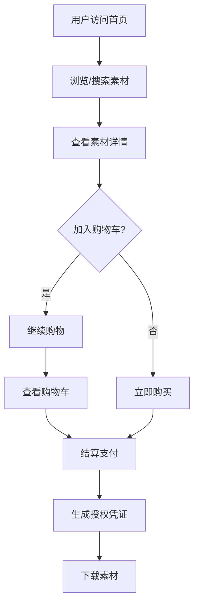
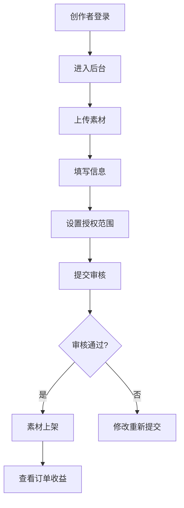

# 图标图片市场 - 产品需求文档

## 1. Product Overview

图标图片市场是一个面向设计师、独立站运营者和中小企业的视觉素材交易平台，提供可商用的图标、图片等视觉素材的浏览、购买和下载服务。平台支持创作者上传素材、设置授权范围，买家可按多种维度筛选素材，支持批量购买和授权凭证生成。

- **核心价值**: 为设计师和企业提供高质量可商用视觉素材，为创作者提供素材销售渠道
- **目标用户**: 设计师、独立站运营者、中小企业、视觉素材创作者

## 2. Core Features

### 2.1 User Roles

| Role | Registration Method | Core Permissions |
|------|---------------------|------------------|
| 普通用户 | 邮箱/第三方注册 | 浏览、搜索、购买、收藏、下载素材 |
| 创作者 | 邮箱注册+身份认证 | 上传素材、设置价格、查看收益、处理退款 |
| 管理员 | 后台登录 | 审核素材、管理用户、系统配置 |

### 2.2 Feature Module

1. **素材首页**: Hero轮播、热门分类、精选素材、推荐创作者
2. **分类浏览**: 按风格/格式/颜色/行业多维度筛选
3. **搜索结果**: 关键词搜索、筛选排序、结果分页
4. **素材详情**: 预览透明背景、多尺寸展示、授权信息、评论收藏
5. **授权购买**: 购物车管理、批量购买、支付流程、授权凭证生成
6. **收藏夹**: 收藏列表、分类管理、一键购买
7. **创作者后台**: 素材管理、订单管理、收益统计、退款处理
8. **订单发票**: 订单列表、发票申请、下载凭证

### 2.3 Page Details

| Page Name | Module Name | Feature description |
|-----------|-------------|---------------------|
| 素材首页 | Hero轮播 | 展示热门素材和促销活动，自动轮播切换 |
| 素材首页 | 分类导航 | 快速跳转到各分类页面 |
| 素材首页 | 精选素材 | 展示优质素材卡片网格 |
| 素材首页 | 推荐创作者 | 展示热门创作者及作品 |
| 分类浏览 | 筛选面板 | 风格、格式、颜色、行业多维度筛选 |
| 分类浏览 | 排序功能 | 按价格、销量、时间排序 |
| 分类浏览 | 结果展示 | 素材卡片网格布局 |
| 搜索结果 | 搜索框 | 关键词搜索、历史记录 |
| 搜索结果 | 筛选排序 | 同分类浏览功能 |
| 素材详情 | 预览区域 | 透明背景预览、多尺寸切换 |
| 素材详情 | 授权信息 | 商用授权范围说明 |
| 素材详情 | 购买按钮 | 加入购物车、立即购买 |
| 素材详情 | 收藏评论 | 收藏、关注创作者、评论列表 |
| 授权购买 | 购物车 | 商品列表、数量调整、批量删除 |
| 授权购买 | 结算页面 | 订单确认、支付方式选择 |
| 授权购买 | 凭证生成 | 购买成功后生成授权凭证 |
| 收藏夹 | 收藏列表 | 按分类展示收藏素材 |
| 收藏夹 | 批量操作 | 批量加入购物车 |
| 创作者后台 | 素材管理 | 上传、编辑、删除素材 |
| 创作者后台 | 订单管理 | 订单列表、发货处理 |
| 创作者后台 | 收益统计 | 销量、收益图表展示 |
| 创作者后台 | 退款处理 | 退款申请审核处理 |
| 订单发票 | 订单列表 | 历史订单查询 |
| 订单发票 | 发票管理 | 发票申请、下载 |

## 3. Core Process

### 3.1 用户购买流程
1. 用户浏览首页或分类页
2. 筛选/搜索找到目标素材
3. 查看素材详情，预览效果
4. 加入购物车或立即购买
5. 结算支付
6. 下载素材和授权凭证

### 3.2 创作者上传流程
1. 登录创作者后台
2. 上传图标包/图片集
3. 填写素材信息（名称、描述、授权范围）
4. 设置价格和格式
5. 提交审核
6. 等待审核通过后上架

### 3.3 流程图

## 4. User Interface Design

### 4.1 Design Style

- **主色调**: 深蓝色 (#1e3a5f) 搭配活力橙色 (#ff6b35) 作为强调色
- **辅助色**: 中性灰 (#f5f7fa) 作为背景，深灰 (#333) 作为文字
- **按钮风格**: 圆角矩形，主按钮渐变背景，悬停有微动画
- **字体**: 标题使用 Inter Bold，正文使用 Inter Regular
- **布局**: 卡片式布局，清晰的网格系统，充足的留白
- **图标**: 使用 lucide-react 图标库，统一风格

### 4.2 Page Design Overview

| Page Name | Module Name | UI Elements |
|-----------|-------------|-------------|
| 素材首页 | Hero轮播 | 全屏轮播图，渐变遮罩，CTA按钮 |
| 素材首页 | 分类导航 | 横向滚动卡片，悬停放大效果 |
| 素材首页 | 精选素材 | 响应式网格卡片，hover阴影效果 |
| 分类浏览 | 筛选面板 | 折叠式筛选器，多选项标签 |
| 素材详情 | 预览区域 | 深色背景预览，尺寸切换按钮 |
| 授权购买 | 购物车 | 侧边栏滑出，商品列表带数量控制 |
| 创作者后台 | 仪表盘 | 数据卡片，图表展示 |

### 4.3 Responsiveness

- **Desktop**: 1200px+，完整功能展示
- **Tablet**: 768px-1199px，自适应布局，筛选器折叠
- **Mobile**: <768px，汉堡菜单，单列布局

### 4.4 交互细节

- 素材卡片悬停显示快速操作按钮
- 图片预览支持透明背景切换
- 购物车实时更新数量和总价
- 平滑滚动和页面过渡动画
