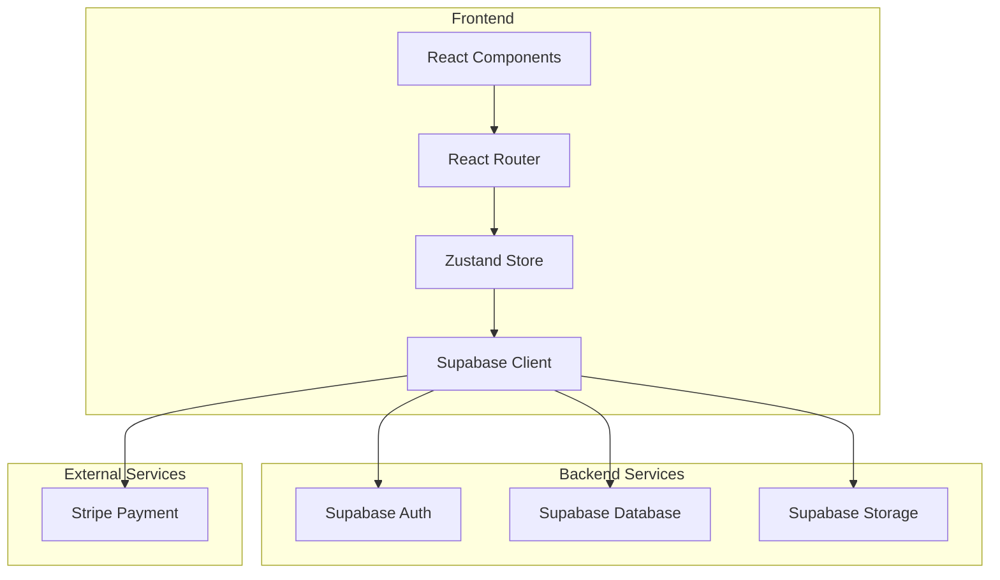
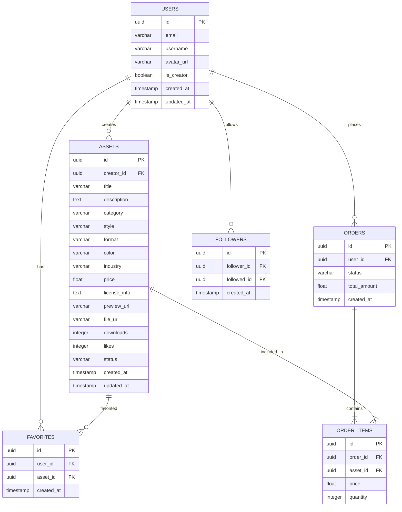

# 图标图片市场 - 技术架构文档

## 1. Architecture Design



## 2. Technology Description

- **Frontend**: React@18 + TypeScript + TailwindCSS@3 + Vite
- **Initialization Tool**: vite-init
- **Backend**: Supabase (Auth, Database, Storage)
- **State Management**: Zustand
- **Routing**: React Router DOM
- **Icons**: lucide-react
- **Payment**: Stripe API
- **Charts**: Chart.js / react-chartjs-2

## 3. Route Definitions

| Route | Purpose | Component |
|-------|---------|-----------|
| / | 素材首页 | HomePage |
| /categories | 分类浏览 | CategoryPage |
| /search | 搜索结果 | SearchPage |
| /assets/:id | 素材详情 | AssetDetailPage |
| /cart | 购物车 | CartPage |
| /checkout | 结算页面 | CheckoutPage |
| /favorites | 收藏夹 | FavoritesPage |
| /creator/dashboard | 创作者后台首页 | CreatorDashboard |
| /creator/assets | 素材管理 | CreatorAssets |
| /creator/orders | 订单管理 | CreatorOrders |
| /creator/earnings | 收益统计 | CreatorEarnings |
| /orders | 订单列表 | OrdersPage |
| /invoices | 发票管理 | InvoicesPage |
| /login | 登录页面 | LoginPage |
| /register | 注册页面 | RegisterPage |

## 4. API Definitions

### 4.1 Auth APIs

| Endpoint | Method | Description |
|----------|--------|-------------|
| /api/auth/signup | POST | 用户注册 |
| /api/auth/login | POST | 用户登录 |
| /api/auth/logout | POST | 用户登出 |
| /api/auth/user | GET | 获取当前用户 |

### 4.2 Asset APIs

| Endpoint | Method | Description |
|----------|--------|-------------|
| /api/assets | GET | 获取素材列表 |
| /api/assets/:id | GET | 获取素材详情 |
| /api/assets | POST | 上传素材（创作者） |
| /api/assets/:id | PUT | 更新素材（创作者） |
| /api/assets/:id | DELETE | 删除素材（创作者） |

### 4.3 Cart APIs

| Endpoint | Method | Description |
|----------|--------|-------------|
| /api/cart | GET | 获取购物车 |
| /api/cart | POST | 添加商品到购物车 |
| /api/cart/:id | PUT | 更新购物车商品数量 |
| /api/cart/:id | DELETE | 删除购物车商品 |

### 4.4 Order APIs

| Endpoint | Method | Description |
|----------|--------|-------------|
| /api/orders | GET | 获取订单列表 |
| /api/orders/:id | GET | 获取订单详情 |
| /api/orders | POST | 创建订单 |
| /api/orders/:id/refund | POST | 申请退款 |

### 4.5 Favorite APIs

| Endpoint | Method | Description |
|----------|--------|-------------|
| /api/favorites | GET | 获取收藏列表 |
| /api/favorites | POST | 添加收藏 |
| /api/favorites/:id | DELETE | 删除收藏 |

### 4.6 Creator APIs

| Endpoint | Method | Description |
|----------|--------|-------------|
| /api/creator/assets | GET | 获取创作者素材 |
| /api/creator/orders | GET | 获取创作者订单 |
| /api/creator/earnings | GET | 获取收益统计 |
| /api/creator/refunds | GET | 获取退款申请 |
| /api/creator/refunds/:id | PUT | 处理退款 |

## 5. Data Model

### 5.1 ER Diagram



### 5.2 DDL Statements

```sql
CREATE TABLE users (
    id UUID PRIMARY KEY DEFAULT gen_random_uuid(),
    email VARCHAR(255) UNIQUE NOT NULL,
    username VARCHAR(100) UNIQUE NOT NULL,
    avatar_url VARCHAR(500),
    is_creator BOOLEAN DEFAULT FALSE,
    created_at TIMESTAMP DEFAULT CURRENT_TIMESTAMP,
    updated_at TIMESTAMP DEFAULT CURRENT_TIMESTAMP
);

CREATE TABLE assets (
    id UUID PRIMARY KEY DEFAULT gen_random_uuid(),
    creator_id UUID REFERENCES users(id) NOT NULL,
    title VARCHAR(200) NOT NULL,
    description TEXT,
    category VARCHAR(50),
    style VARCHAR(50),
    format VARCHAR(50),
    color VARCHAR(50),
    industry VARCHAR(50),
    price FLOAT NOT NULL,
    license_info TEXT,
    preview_url VARCHAR(500) NOT NULL,
    file_url VARCHAR(500) NOT NULL,
    downloads INTEGER DEFAULT 0,
    likes INTEGER DEFAULT 0,
    status VARCHAR(20) DEFAULT 'pending',
    created_at TIMESTAMP DEFAULT CURRENT_TIMESTAMP,
    updated_at TIMESTAMP DEFAULT CURRENT_TIMESTAMP
);

CREATE TABLE orders (
    id UUID PRIMARY KEY DEFAULT gen_random_uuid(),
    user_id UUID REFERENCES users(id) NOT NULL,
    status VARCHAR(20) DEFAULT 'pending',
    total_amount FLOAT NOT NULL,
    created_at TIMESTAMP DEFAULT CURRENT_TIMESTAMP
);

CREATE TABLE order_items (
    id UUID PRIMARY KEY DEFAULT gen_random_uuid(),
    order_id UUID REFERENCES orders(id) NOT NULL,
    asset_id UUID REFERENCES assets(id) NOT NULL,
    price FLOAT NOT NULL,
    quantity INTEGER DEFAULT 1
);

CREATE TABLE favorites (
    id UUID PRIMARY KEY DEFAULT gen_random_uuid(),
    user_id UUID REFERENCES users(id) NOT NULL,
    asset_id UUID REFERENCES assets(id) NOT NULL,
    created_at TIMESTAMP DEFAULT CURRENT_TIMESTAMP,
    UNIQUE(user_id, asset_id)
);

CREATE TABLE followers (
    id UUID PRIMARY KEY DEFAULT gen_random_uuid(),
    follower_id UUID REFERENCES users(id) NOT NULL,
    followed_id UUID REFERENCES users(id) NOT NULL,
    created_at TIMESTAMP DEFAULT CURRENT_TIMESTAMP,
    UNIQUE(follower_id, followed_id)
);

CREATE INDEX idx_assets_category ON assets(category);
CREATE INDEX idx_assets_style ON assets(style);
CREATE INDEX idx_assets_creator ON assets(creator_id);
CREATE INDEX idx_orders_user ON orders(user_id);
```

### 5.3 RLS Policies

```sql
-- Users table
GRANT SELECT ON users TO anon;
GRANT ALL ON users TO authenticated;

-- Assets table
GRANT SELECT ON assets TO anon;
GRANT ALL ON assets TO authenticated;

CREATE POLICY "Users can view all assets" ON assets
    FOR SELECT USING (true);

CREATE POLICY "Creators can manage their assets" ON assets
    FOR ALL USING (auth.uid() = creator_id);

-- Orders table
GRANT SELECT ON orders TO authenticated;
GRANT INSERT ON orders TO authenticated;
GRANT UPDATE ON orders TO authenticated;

CREATE POLICY "Users can view their orders" ON orders
    FOR SELECT USING (auth.uid() = user_id);

CREATE POLICY "Users can create orders" ON orders
    FOR INSERT WITH CHECK (auth.uid() = user_id);

-- Favorites table
GRANT ALL ON favorites TO authenticated;

CREATE POLICY "Users can manage their favorites" ON favorites
    FOR ALL USING (auth.uid() = user_id);
```

## 6. Project Structure

```
src/
├── components/           # 公共组件
│   ├── Header.tsx       # 顶部导航
│   ├── Footer.tsx       # 底部信息
│   ├── AssetCard.tsx    # 素材卡片
│   ├── FilterPanel.tsx  # 筛选面板
│   ├── CartDrawer.tsx   # 购物车抽屉
│   └── ...
├── pages/               # 页面组件
│   ├── HomePage.tsx     # 首页
│   ├── CategoryPage.tsx # 分类页
│   ├── SearchPage.tsx   # 搜索页
│   ├── AssetDetailPage.tsx # 素材详情
│   ├── CartPage.tsx     # 购物车
│   ├── CheckoutPage.tsx # 结算页
│   ├── FavoritesPage.tsx # 收藏夹
│   ├── CreatorDashboard.tsx # 创作者后台
│   ├── CreatorAssets.tsx # 素材管理
│   ├── CreatorOrders.tsx # 订单管理
│   ├── CreatorEarnings.tsx # 收益统计
│   ├── OrdersPage.tsx   # 订单列表
│   ├── InvoicesPage.tsx # 发票管理
│   ├── LoginPage.tsx    # 登录页
│   └── RegisterPage.tsx # 注册页
├── store/               # Zustand状态管理
│   ├── authStore.ts     # 认证状态
│   ├── cartStore.ts     # 购物车状态
│   ├── favoriteStore.ts # 收藏状态
│   └── filterStore.ts   # 筛选状态
├── utils/               # 工具函数
│   ├── supabase.ts      # Supabase配置
│   ├── api.ts           # API封装
│   └── helpers.ts       # 辅助函数
├── types/               # TypeScript类型定义
│   └── index.ts         # 类型定义
├── App.tsx              # 根组件
├── main.tsx             # 入口文件
└── index.css            # 全局样式
```

## 7. Security Considerations

1. **JWT认证**: 使用Supabase Auth处理用户认证
2. **数据权限**: 通过RLS策略限制数据访问
3. **文件上传**: 限制文件类型和大小，使用Supabase Storage
4. **支付安全**: 使用Stripe处理支付，前端不存储敏感信息
5. **HTTPS**: 全站使用HTTPS协议
6. **输入验证**: 前端和后端双重验证用户输入
7. **XSS防护**: 使用React内置XSS防护机制
